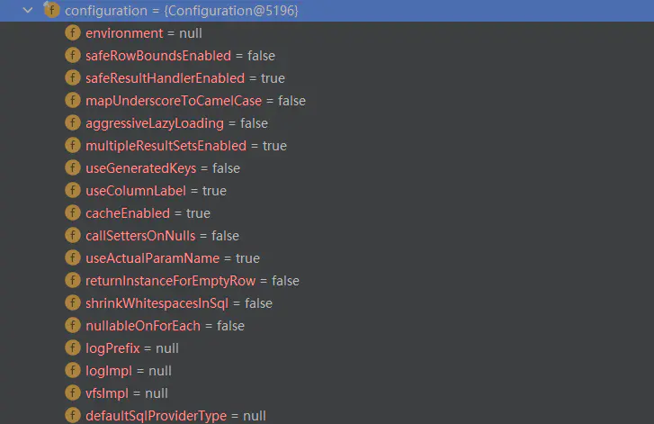
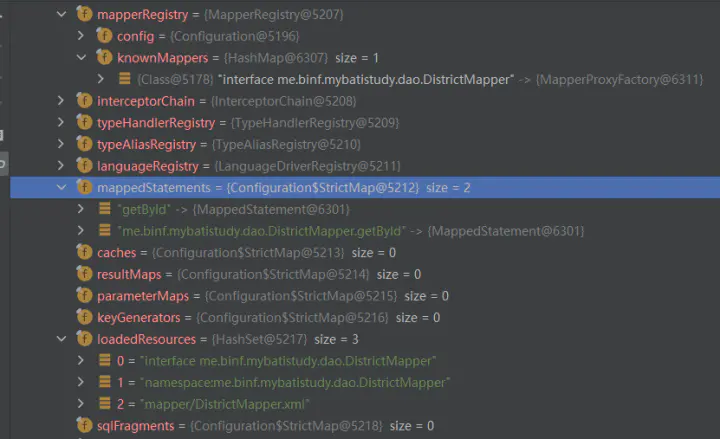
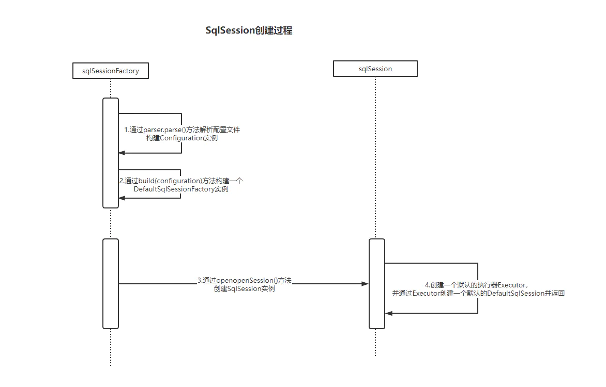

# mybatis源码分析（一）：自己动手写一个简单的mybaits框架


## 框架解决了什么问题

目前主流的Java Web项目都采用SSM(spring springmvc mybatis)框架，其中mybatis框架源码是最简单的，想入手源码学习的同学很推荐从mybatis开始。本系列文章是我对mybatis源码学习的一些梳理总结，可以帮助你更高效得理解mybatis。
在学习一个框架源码之前你首先要问自己几个问题。
1.这个框架解决了什么问题？
2.为了解决这个问题，你是如何设计的？框架是如何设计的？
3.框架是怎么样给你提供扩展性的？

通常第一个问题都很简单，可以直接在mybatis官网找到答案。mybatis官网是这么解释的：

>MyBatis 是一款优秀的持久层框架，它支持自定义 SQL、存储过程以及高级映射。MyBatis 免除了几乎所有的 JDBC 代码以及设置参数和获取结果集的工作。MyBatis 可以通过简单的 XML 或注解来配置和映射原始类型、接口和 Java POJO（Plain Old Java Objects，普通老式 Java 对象）为数据库中的记录。

我的理解是mybatis是一个持久层框架，它解决了使用JDBC冗余复杂代码操作数据库的问题，并且可以通过XML或者注解的方式来实现ORM（对象关系映射）技术，使我们在项目中操作数据库更为简单和耦合性更好。

##自己实现一个简单的mybatis框架

在学习源码之前先自己简单实现一遍类似的功能是很有必要的，可以帮助你更好的理解框架是解决问题的。假如要你实现一个简单的mybatis框架你会怎么做？
先不用去看mybatis的细节，我们知道使用mybatis的时候在注解或者xml中定义一个sql然后绑定到一个接口的方法上就能执行这条sql，并给你封装好结果返回。实现这个功能并不难，我们可以先尝试实现一遍。
我们也定义一个接口，不需要写实现类就可以执行接口定义的方法，且这个方法帮我们去执行注解里的sql语句：

```java
public interface DistrictDao {

    @MyQuery(" select * from district where id = ? ")
    List<District> getDistrictById(Integer id);

}
```

要实现这个功能用JDK的动态代理就可以了，我们可以建一个工厂类，用这个工厂类可以生成任意接口的代理对象，代理对象帮我们执行方法上定义的SQL并封装成结果。
简单的实现了一下可以执行任意查询语句的代理工厂类：

```java
public class DBHandlerProxyFactory {

    /**
     * 获取代理对象
     *
     * @param dataSource
     * @param clazz
     * @param <T>
     * @return
     */
    public static <T> T getTargetClass(DataSource dataSource, Class<T> clazz) {
        return (T) Proxy.newProxyInstance(
                clazz.getClassLoader(), // 传入ClassLoader
                new Class[]{clazz}, // 传入要实现的接口
                getQueryInvHandler(dataSource)); // 传入处理调用方法的InvocationHandler
    }

    /**
     * 获取动态代理执行handler
     * @param dataSource
     * @return
     */
    public static InvocationHandler getQueryInvHandler(DataSource dataSource) {
        InvocationHandler handler = new InvocationHandler() {
            @Override
            public Object invoke(Object proxy, Method method, Object[] args) throws Throwable {

                MyQuery myQuery = method.getAnnotation(MyQuery.class);
                if (myQuery != null) {
                    //1.拿到目标方法上面的sql
                    String sql = myQuery.value();
                    //2.拿到数据库连接并执行sql
                    Connection connection = dataSource.getConnection();
                    Statement statement = connection.createStatement();
                    int i = 0;
                    while (sql.contains("?")) {
                        sql = sql.replaceFirst("\\?", args[i] + "");
                        i++;
                    }
                    System.out.println("执行sql语句：" + sql);
                    ResultSet resultSet = statement.executeQuery(sql);
                    //3.获取目标方法的返回类型
                    Type returnType = method.getGenericReturnType();
                    Class<?> returnTypeClass = null;
                    if (returnType instanceof Class) {
                        returnTypeClass = (Class<?>) returnType;
                    } else {
                        ParameterizedTypeImpl r = (ParameterizedTypeImpl) method.getGenericReturnType();
                        returnTypeClass = r.getRawType();
                        if (Collection.class.isAssignableFrom(returnTypeClass)) {
                            Type[] types = r.getActualTypeArguments();
                            returnTypeClass = (Class<?>) types[0];
                        }
                    }
                    //4.封装返回结果
                    List<?> list = getQueryResult(resultSet, returnTypeClass);
                    resultSet.close();
                    connection.close();
                    return list;
                }
                return new ArrayList<>();
            }
        };
        return handler;
    }


    /**
     * 获取查询结果
     *
     * @param resultSet
     * @param clazz
     * @param <T>
     * @return
     */
    public static <T> List<T> getQueryResult(ResultSet resultSet, Class<T> clazz) {
        List<T> list = new ArrayList<>();
        try {
            while (resultSet.next()) {
                T obj = clazz.newInstance();
                ResultSetMetaData rsmeta = resultSet.getMetaData();
                int count = rsmeta.getColumnCount();
                for (int i = 0; i < count; i++) {
                    String name = rsmeta.getColumnName(i + 1);
                    Field f = obj.getClass().getDeclaredField(name);
                    f.setAccessible(true);
                    f.set(obj, resultSet.getObject(name));
                }
                list.add(obj);
            }
        } catch (Exception e) {
            e.printStackTrace();
        }
        return list;
    }

}
```

这里就不阐述动态代理了，动态代理handler执行思路是：
1.拿到目标方法上面的sql
2.拿到数据库连接并使用JDBC的API来执行sql
3.获取目标方法的返回类型
4.封装返回结果

通过这四步就可以不用再写冗余的JDBC代码了，只用写接口就可以查询数据并返回封装好的结果了。执行代码是这样的：
```java
@SpringBootTest
class MybatisStudyApplicationTests {

    @Autowired
    private DataSource dataSource;


    @Test
    void testProxy(){
        DistrictDao districtDao = DBHandlerProxyFactory.getTargetClass(dataSource,DistrictDao.class);
        List<District> districtList =  districtDao.getDistrictById(1);
        System.out.println(districtList);
    }
}
```
OK，到这里自己尝试设计一个简单“MyBatis”功能就完成了，接下来我们需要分析一下我们自己写的这个简单的框架有那些问题和缺陷。我们带着问题再去看Mybatis源码就会明白作者的设计意图，再看看Mybatis作者是如何解决这些问题的，这样学习源码会更有收获一些。

## 自己实现mybatis框架的缺陷

1.操作数据库只支持查询的操作而且代码复用性不高，如果要支持增删改查的操作该如何设计

2.封装结果集只支持集合类型，而且返回的实例字段只能和表字段名称一致才能映射，如何把结果集封装设计的更灵活一些

3.参数转换如何实现，例如传入的是Java的日期类型，应该怎么样转换成数据库支持的格式

4.预编译SQL以及数据库的事务如何实现

5.如何加入缓存策略

**目前能想到的就是这些，然后我们带着这些问题逐步深入mybatis的源码来看一下mybatis是如何设计的。**

# mybatis源码分析（二）：mybatis在执行SQL语句之前都做了什么


## SqlSessionFactory构建过程
在上一遍我们通过JDK的动态代理简单实现了一个“mybatis框架”（[mybatis源码分析（一）：自己动手写一个简单的mybaits框架](https://zhuanlan.zhihu.com/p/461230314)），并分析了一下我们自己的框架还有那些问题需要解决，带着这些问题我们就可以去看一下mybatis的源码。mybatis作为一个持久层框架是如何解决这些问题的。

学习一个框架的基本步骤就是找到框架的源码的入口，然后打断点一步一步看内部的实现细节。看官方的文档mybatis的入口大概是这样的：

> 每个基于 MyBatis 的应用都是以一个 SqlSessionFactory 的实例为核心的。SqlSessionFactory 的实例可以通过 SqlSessionFactoryBuilder 获得。而 SqlSessionFactoryBuilder 则可以从 XML 配置文件或一个预先配置的 Configuration 实例来构建出 SqlSessionFactory 实例。 既然有了 SqlSessionFactory，顾名思义，我们可以从中获得 SqlSession 的实例。SqlSession 提供了在数据库执行 SQL 命令所需的所有方法。你可以通过 SqlSession 实例来直接执行已映射的 SQL 语句。

也就是说，使用mybatis首先需要构建出SqlSessionFactory，然后通过SqlSessionFactory获得SqlSession实例，再通过SqlSession就可以操作数据库了。

所以mybatis的入口是SqlSession，那么我们首先需要了解SqlSessionFactory是怎么构建的，SqlSession又是怎么被创建出来的，我们通过代码逐步分析一下。

构建SqlSessionFactory代码：
```java
public SqlSessionFactory getSqlSessionFactory() throws IOException {
        String resource = "mybatis/mybatis-config.xml";
        InputStream inputStream = Resources.getResourceAsStream(resource);
        SqlSessionFactory sqlSessionFactory = new SqlSessionFactoryBuilder().build(inputStream);
        //1、拿到全局配置
        TransactionFactory transactionFactory = new JdbcTransactionFactory();
        //准备环境信息
        Environment environment = new Environment("development", transactionFactory, dataSource);
        //2、使用我们的数据源
        sqlSessionFactory.getConfiguration().setEnvironment(environment);
        //使用mybatis-config.xml + Spring的数据源
        return sqlSessionFactory;
    }
```
我这里是用mybatis配置文件构建的SqlSessionFactory，当然也可以用其他方法。接下来我们看一下SqlSessionFactory在构建的过程中都做了些什么。

核心是这一行代码：
```java
SqlSessionFactory sqlSessionFactory = new SqlSessionFactoryBuilder().build(inputStream);
```
mybatis的源码：
```java
public SqlSessionFactory build(InputStream inputStream, String environment, Properties properties) {
    try {
      XMLConfigBuilder parser = new XMLConfigBuilder(inputStream, environment, properties);
      return build(parser.parse());
    } catch (Exception e) {
      throw ExceptionFactory.wrapException("Error building SqlSession.", e);
    } finally {
      ErrorContext.instance().reset();
      try {
        inputStream.close();
      } catch (IOException e) {
        // Intentionally ignore. Prefer previous error.
      }
    }
  }

  //
  public SqlSessionFactory build(Configuration config) {
    return new DefaultSqlSessionFactory(config);
  }
```
SqlSessionFactory子类DefaultSqlSessionFactory的构造方法：
```
public class DefaultSqlSessionFactory implements SqlSessionFactory {

  private final Configuration configuration;

  public DefaultSqlSessionFactory(Configuration configuration) {
    this.configuration = configuration;
  }

.....
}
```
我们可以看到SqlSessionFactory构造方法非常简单，创建一个DefaultSqlSessionFactory，而DefaultSqlSessionFactory实例在实例化的时候需要创建了一个Configuration实例，而Configuration实例是通过XMLConfigBuilder实例的parse()方法得到的。

那么重点就是Configuration，我们来看一下SqlSessionFactory的Configuration是个什么东西。
```java
public class Configuration {

  protected Environment environment;


  protected boolean useGeneratedKeys;
  protected boolean useColumnLabel = true;
  protected boolean cacheEnabled = true;
  protected boolean callSettersOnNulls;
  protected boolean useActualParamName = true;
  protected boolean returnInstanceForEmptyRow;
  .....

  protected Class<? extends Log> logImpl;
  protected Class<? extends VFS> vfsImpl;
  protected Class<?> defaultSqlProviderType;
  protected LocalCacheScope localCacheScope = LocalCacheScope.SESSION;
  protected JdbcType jdbcTypeForNull = JdbcType.OTHER;

  protected Properties variables = new Properties();
  protected ReflectorFactory reflectorFactory = new DefaultReflectorFactory();
  protected ObjectFactory objectFactory = new DefaultObjectFactory();
  protected ObjectWrapperFactory objectWrapperFactory = new DefaultObjectWrapperFactory();

  protected boolean lazyLoadingEnabled = false;
  protected ProxyFactory proxyFactory = new JavassistProxyFactory(); // #224 Using internal Javassist instead of OGNL

  protected String databaseId;

  protected Class<?> configurationFactory;

  protected final MapperRegistry mapperRegistry = new MapperRegistry(this);
  protected final InterceptorChain interceptorChain = new InterceptorChain();
  protected final TypeHandlerRegistry typeHandlerRegistry = new TypeHandlerRegistry(this);
  protected final TypeAliasRegistry typeAliasRegistry = new TypeAliasRegistry();
  protected final LanguageDriverRegistry languageRegistry = new LanguageDriverRegistry();
  ......
}
```

我们可以看到Configuration里面全部都是mybatis框架本身的所有的配置以及各种组件的定义，从Configuration中我们可以得到很多的信息，有“cacheEnabled”缓存的配置，有“lazyLoadingEnabled”懒加载的配置，有“InterceptorChain”拦截器的配置等等等。

那么可以推测出mybatis会把所有的配置项提前构建好，Configuration里面有什么mybatis这个框架就会支持什么。我们可以再顺便看一下源码里Configuration里面的配置项是如何赋值的，这些配置项的来源是什么。这样我们就可以熟练的配置mybatis了。

```java
public Configuration parse() {
    if (parsed) {
      throw new BuilderException("Each XMLConfigBuilder can only be used once.");
    }
    parsed = true;
    parseConfiguration(parser.evalNode("/configuration"));
    return configuration;
  }

  private void parseConfiguration(XNode root) {
    try {
      // issue #117 read properties first
      propertiesElement(root.evalNode("properties"));
      Properties settings = settingsAsProperties(root.evalNode("settings"));
      loadCustomVfs(settings);
      loadCustomLogImpl(settings);
      typeAliasesElement(root.evalNode("typeAliases"));
      pluginElement(root.evalNode("plugins"));
      objectFactoryElement(root.evalNode("objectFactory"));
      objectWrapperFactoryElement(root.evalNode("objectWrapperFactory"));
      reflectorFactoryElement(root.evalNode("reflectorFactory"));
      settingsElement(settings);
      // read it after objectFactory and objectWrapperFactory issue #631
      environmentsElement(root.evalNode("environments"));
      databaseIdProviderElement(root.evalNode("databaseIdProvider"));
      typeHandlerElement(root.evalNode("typeHandlers"));
      mapperElement(root.evalNode("mappers"));
    } catch (Exception e) {
      throw new BuilderException("Error parsing SQL Mapper Configuration. Cause: " + e, e);
    }
  }
```
看到这里就有一种很熟悉的感觉了，XNode就是XML的节点对象，而“mappers”，"properties"，"settings"这些东西都是mybatis官方给的xml配置项，mybatis会解析我们配置的mybatis.xml，然后通过xml的配置给Configuration对象赋值。

还有XMLConfigBuilder构造方法里面有一个super(newConfiguration())调用父类的构造方法。

```java
  private XMLConfigBuilder(XPathParser parser, String environment, Properties props) {
    super(new Configuration());
    ErrorContext.instance().resource("SQL Mapper Configuration");
    this.configuration.setVariables(props);
    this.parsed = false;
    this.environment = environment;
    this.parser = parser;
  }
```
构造方法会去赋值typeAliasRegistry和typeHandlerRegistry这两个属性。
```
 public BaseBuilder(Configuration configuration) {
    this.configuration = configuration;
    this.typeAliasRegistry = this.configuration.getTypeAliasRegistry();
    this.typeHandlerRegistry = this.configuration.getTypeHandlerRegistry();
  }
```

typeAliasRegistry和typeHandlerRegistry这两个属性的值是在Configuration里面写死的。
```

  public TypeAliasRegistry() {
    registerAlias("string", String.class);
    registerAlias("byte", Byte.class);
    registerAlias("long", Long.class);
    registerAlias("short", Short.class);
    registerAlias("int", Integer.class);
    registerAlias("integer", Integer.class);
    registerAlias("double", Double.class);
    registerAlias("float", Float.class);
    registerAlias("boolean", Boolean.class);
    ......
  }

 public TypeHandlerRegistry(Configuration configuration) {
    this.unknownTypeHandler = new UnknownTypeHandler(configuration);

    register(Boolean.class, new BooleanTypeHandler());
    register(boolean.class, new BooleanTypeHandler());
    register(JdbcType.BOOLEAN, new BooleanTypeHandler());
    register(JdbcType.BIT, new BooleanTypeHandler());

    register(Byte.class, new ByteTypeHandler());
    register(byte.class, new ByteTypeHandler());
    register(JdbcType.TINYINT, new ByteTypeHandler());
    ......

  }
```
可以总结一下，Configuration的配置项来源于xml配置和mybatis自己定义的部分，这些配置在SqlSessionFactory构建的时候就会全部初始化好。
例如我们的mybatis-config.xml是这样的：
```
<?xml version="1.0" encoding="UTF-8" ?>
<!DOCTYPE configuration
        PUBLIC "-//mybatis.org//DTD Config 3.0//EN"
        "http://mybatis.org/dtd/mybatis-3-config.dtd">
<configuration>

    <mappers>
        <mapper resource="mapper/DistrictMapper.xml"/>
    </mappers>

</configuration>
```
就会得到如下的赋值：




同时mybatis还会加载我们在mapper.xml里定义的sql方法，并把他封装在了mappedStatements和loadedResources里了。

## SqlSession构建过程

那么构建SqlSessionFactory的流程就大概整明白了，我们接下来看一下SqlSession是怎么被创建出来的。
先写一段测试代码：
```java
    @Test
    public void testMyBatis() throws IOException {
        //1、得到 SqlSessionFactory
        SqlSessionFactory sqlSessionFactory = getSqlSessionFactory();
        //2、得到 sqlSession ,代表和数据库一次回话
        SqlSession sqlSession = sqlSessionFactory.openSession();
        //3、得到真正操作数据库的Dao
        DistrictMapper mapper = sqlSession.getMapper(DistrictMapper.class);
        District district = mapper.getById(1);
        System.out.println(district);
        sqlSession.close();
    }
```


先看这一句：
```java
  SqlSession sqlSession = sqlSessionFactory.openSession();
```
mybaits的源码是这样的：
```java
  @Override
  public SqlSession openSession() {
    return openSessionFromDataSource(configuration.getDefaultExecutorType(), null, false);
  }
  @Override
  public SqlSession openSession(ExecutorType execType) {
    return openSessionFromDataSource(execType, null, false);
  }

  @Override
  public SqlSession openSession(TransactionIsolationLevel level) {
    return openSessionFromDataSource(configuration.getDefaultExecutorType(), level, false);
  }

  @Override
  public SqlSession openSession(ExecutorType execType, TransactionIsolationLevel level) {
    return openSessionFromDataSource(execType, level, false);
  }
  .....

  private SqlSession openSessionFromDataSource(ExecutorType execType, TransactionIsolationLevel level, boolean autoCommit) {
    Transaction tx = null;
    try {
      final Environment environment = configuration.getEnvironment();
      final TransactionFactory transactionFactory = getTransactionFactoryFromEnvironment(environment);
      tx = transactionFactory.newTransaction(environment.getDataSource(), level, autoCommit);
      final Executor executor = configuration.newExecutor(tx, execType);
      return new DefaultSqlSession(configuration, executor, autoCommit);
    } catch (Exception e) {
      closeTransaction(tx); // may have fetched a connection so lets call close()
      throw ExceptionFactory.wrapException("Error opening session.  Cause: " + e, e);
    } finally {
      ErrorContext.instance().reset();
    }
  }
```
可以看到openSession是一个重载的方法，它们都会通过openSessionFromDataSource去创建openSession，而openSessionFromDataSource接受三个参数：ExecutorType（执行器类型），TransactionIsolationLevel（数据库隔离级别），autoCommit（是否自动提交）。

用户可以通过重载的方法创建不同的SqlSession，我们使用的是无参的openSession方法，ExecutorType会被赋值成默认的ExecutorType.SIMPLE类型。

再接着看，openSessionFromDataSource这三段代码。

```java
      final Environment environment = configuration.getEnvironment();
      final TransactionFactory transactionFactory = getTransactionFactoryFromEnvironment(environment);
      tx = transactionFactory.newTransaction(environment.getDataSource(), level, autoCommit);
```
我们通过前面配置好的configuration拿到environment，又通过environment 拿到我们已经创建好的TransactionFactory（事务工厂），再通过事务工厂拿到Transaction对象。

通过源码可以看到这里也是仅仅创建了一个对象，并没有其他操作。
```java
  @Override
  public Transaction newTransaction(DataSource ds, TransactionIsolationLevel level, boolean autoCommit) {
    return new JdbcTransaction(ds, level, autoCommit);
  }
```
然后重点是这个代码：
```java
  final Executor executor = configuration.newExecutor(tx, execType);
```
Executor执行器，这个名字很核心然后我们看一下Executor是个什么东西。

根据参数可以看到openSession方法给我们创建了一个SimpleExecutor执行器，除此之外我们还可以创建BatchExecutor、ReuseExecutor、CachingExecutor。
```java
public Executor newExecutor(Transaction transaction, ExecutorType executorType) {
    executorType = executorType == null ? defaultExecutorType : executorType;
    executorType = executorType == null ? ExecutorType.SIMPLE : executorType;
    Executor executor;
    if (ExecutorType.BATCH == executorType) {
      executor = new BatchExecutor(this, transaction);
    } else if (ExecutorType.REUSE == executorType) {
      executor = new ReuseExecutor(this, transaction);
    } else {
      executor = new SimpleExecutor(this, transaction);
    }
    if (cacheEnabled) {
      executor = new CachingExecutor(executor);
    }
    executor = (Executor) interceptorChain.pluginAll(executor);
    return executor;
  }
```
然后可以看到SimpleExecutor就是真正去执行Sql语句的组件，并且继承BaseExecutor。而BaseExecutor几乎实现了操作数据库的所有方法。
```java
public class SimpleExecutor extends BaseExecutor {

  public SimpleExecutor(Configuration configuration, Transaction transaction) {
    super(configuration, transaction);
  }

  @Override
  public int doUpdate(MappedStatement ms, Object parameter) throws SQLException {
    Statement stmt = null;
    try {
      Configuration configuration = ms.getConfiguration();
      StatementHandler handler = configuration.newStatementHandler(this, ms, parameter, RowBounds.DEFAULT, null, null);
      stmt = prepareStatement(handler, ms.getStatementLog());
      return handler.update(stmt);
    } finally {
      closeStatement(stmt);
    }
  }

  @Override
  public <E> List<E> doQuery(MappedStatement ms, Object parameter, RowBounds rowBounds, ResultHandler resultHandler, BoundSql boundSql) throws SQLException {
    Statement stmt = null;
    try {
      Configuration configuration = ms.getConfiguration();
      StatementHandler handler = configuration.newStatementHandler(wrapper, ms, parameter, rowBounds, resultHandler, boundSql);
      stmt = prepareStatement(handler, ms.getStatementLog());
      return handler.query(stmt, resultHandler);
    } finally {
      closeStatement(stmt);
    }
  }
  ......

}
```
看到这里openSession的所有操作就看完了。可以总结一下：

1.openSession通过之前构建好的Configuration实例拿到了Transaction对象
2.通过transaction对象和ExecutorType类型给我们创建好了一个数据库的执行器Executor，默认的Executor是SimpleExecutor
3.通过Executor创建了一个DefaultSqlSession实例给我们

可以画个时序图出来：


我们可以看到，到这一步mybatis都没开始连接数据库。而是帮我们把一切东西都准备好，其中最核心的东西就是SimpleExecutor，接下来应该就是我们操作数据库的主角SimpleExecutor要登场了。

下面一篇文章我将带着大家一起学习mybatis核心组件Executor的执行过程，希望可以给你带来收获。


